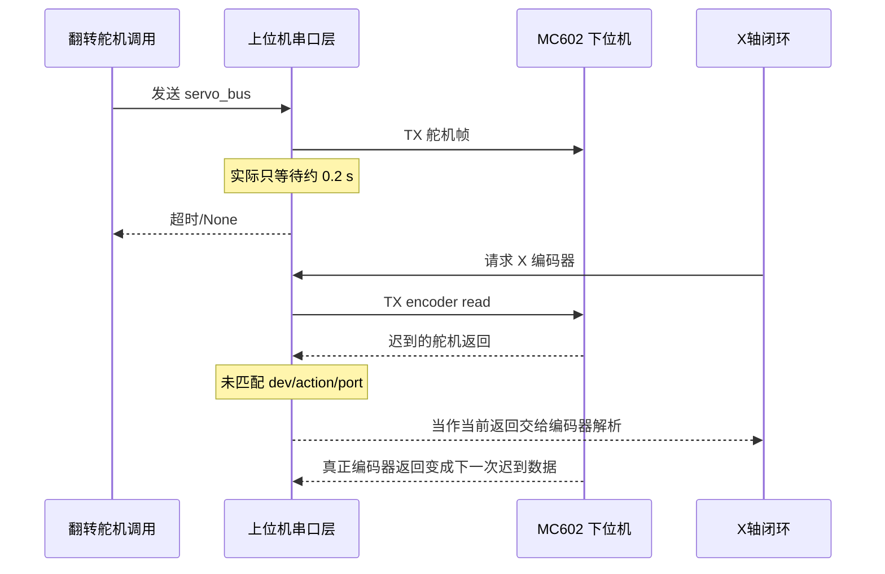

# MC602 机械臂 X 轴与左右翻转舵机通讯干扰分析报告

> 日期：2026-07-27  
> 分析对象：MC602 上下位机串口通讯、机械臂 X 轴电机、X 轴编码器、左右翻转总线舵机  
> 当前结论状态：静态代码与协议分析完成，根因仍需一次串口抓包和最小化硬件复现实验确认  
> 本报告只记录分析和调试方案，不包含生产代码修改

## 1. 执行摘要

机械臂 X 轴与左右翻转舵机“相互干扰”的现象，不像普通的上层动作顺序错误，更像 MC602 通讯协议实现不一致和应答关联不足共同造成的问题。

当前最重要的发现如下。

1. MC602 串口为 `1,000,000 baud, 8N1`，无 UART 奇偶校验；应用层帧也没有 CRC 或 checksum。
2. 上位机对读、写、复位命令都执行“发送后等待返回”，因此下位机存在返回帧机制。
3. 该返回机制不是可靠 ACK：没有请求序号、状态码和执行结果，上位机也没有核对返回帧的 `dev_id/action/port_id`。
4. MC602 协议表将 `servo_bus` 角度定义为 1 字节、整帧长度为 `0x0A`；2025 和 2026 Python 实现使用 2 字节有符号角度，实际整帧长度为 `0x0B`。
5. `ServoBus_2` 将超时设为 1 秒，但串口层没有把该参数继续传给 MC602 接收函数，实际仍使用约 0.2 秒。
6. 每次事务开始前都会同时清空串口输入和输出缓冲区。迟到应答可能被丢弃，也可能在下一事务发送后到达并被误收。
7. X 轴编码器与当前代码生成的总线舵机数据结构都是 7 字节；在没有设备身份匹配的情况下，迟到的舵机返回存在进入编码器解析路径的风险。
8. 当前 2026 工作树会把同一翻转命令发送 3 次、间隔 0.5 秒。这是经验性重发，不是可靠应答机制；在应答错配问题存在时，可能增加迟到返回帧数量。

综合判断：

- **首要协议嫌疑**：`servo_bus` 的 1 字节/2 字节角度和 `0x0A/0x0B` 帧长不一致。
- **首要事务嫌疑**：舵机 1 秒超时未生效，迟到应答缺少请求关联，可能污染后续 X 轴编码器读取。
- **次要调度嫌疑**：X 轴闭环高频读写串口，使舵机命令排队或延迟；当前 3 次重复发送进一步增加总线占用。
- **较低概率的软件嫌疑**：两个线程把原始字节同时写成交叉帧。当前共享锁基本排除了这种情况。
- **仍需排除的硬件因素**：舵机动作造成供电压降、地弹、EMI 或 MC602 复位。仅凭代码无法排除，必须同步记录电源和串口。

## 2. 问题背景与范围

### 2.1 现场现象

- 机械臂 X 轴和左右翻转舵机会相互影响。
- 从上层机械臂动作逻辑中暂未发现明显的目标位置或方向计算错误。
- 实际控制器是 MC602，不是最初参考的 MC601。

### 2.2 本次分析范围

本次分析覆盖：

- MC602 串口封装和帧解析；
- MC602 电机、编码器、PWM 舵机和总线舵机命令打包；
- 2025 机械臂 X 轴和翻转舵机配置；
- 2026 当前机械臂配置及重复发送行为；
- 协议表与代码的逐字段对照；
- 线程锁、超时、缓冲区和应答匹配；
- 现场复现、抓包、判定标准和后续修复方向。

本次不覆盖：

- MC602 固件源代码内部实现，因为当前工作树只有下载程序和 Python 上位机，没有找到下位机命令解析源码；
- 未经抓包验证的生产代码修改；
- 机械、电源、接线方面的最终定责。

## 3. 证据来源

### 3.1 权威协议

- [MC602 通讯协议 Excel](../../../../通讯协议.xlsx)
- 工作表：`Sheet1`
- 通用帧与操作码：`A2:G18`
- Motor：`A24:I25`
- Encoder：`A30:L31`
- Servo PWM：`A33:J34`
- Servo Bus：`A35:K37`

### 3.2 2025 参考实现

- [`serial_wrap.py`](../../../../2025/code_vehicle_wbt/vehicle/base/serial_wrap.py)
- [`mc602_ctl2.py`](../../../../2025/code_vehicle_wbt/vehicle/base/mc602_ctl2.py)
- [`controller_wrap.py`](../../../../2025/code_vehicle_wbt/vehicle/base/controller_wrap.py)
- [`arm_base.py`](../../../../2025/code_vehicle_wbt/vehicle/arm/arm_base.py)
- [`arm_cfg.yaml`](../../../../2025/code_vehicle_wbt/vehicle/arm/arm_cfg.yaml)

### 3.3 当前 2026 实现

- [`serial_wrap.py`](../../smartcar/whalesbot/vehicle/base/serial_wrap.py)
- [`mc602_ctl2.py`](../../smartcar/whalesbot/vehicle/base/mc602_ctl2.py)
- [`controller_wrap.py`](../../smartcar/whalesbot/vehicle/base/controller_wrap.py)
- [`arm_base.py`](../../smartcar/whalesbot/vehicle/arm/arm_base.py)
- [`arm_cfg.yaml`](../../smartcar/whalesbot/vehicle/arm/arm_cfg.yaml)
- [`car_wrap_2026.py`](../../car_wrap_2026.py)

2026 的底层 MC602 帧结构、串口锁、缓冲区处理和应答读取方式基本继承了 2025 实现。当前工作树存在大量未提交改动，本报告没有覆盖或回退这些改动。

## 4. MC602 通讯链路

### 4.1 调用链


### 4.2 串口配置

2025 和 2026 串口均配置为：

```text
baudrate = 1,000,000（识别为 MC602 后）
data bits = 8
parity = none
stop bits = 1
flow control = off
```

因此 UART 硬件层不提供奇偶校验。通信完整性完全依赖应用层协议，但应用层当前也没有 CRC/checksum。

### 4.3 通用应用层帧

协议定义：

```text
+--------+--------+----------+------------------+--------+
| 0x77   | 0x68   | 总帧长度 | 一个或多个操作数据 | 0x0A   |
+--------+--------+----------+------------------+--------+
```

代码生成逻辑：

```python
cmd_len = (len(cmd) + 4).to_bytes(1, "big")
cmd_all = b"\x77\x68" + cmd_len + cmd + b"\x0A"
```

`+4` 对应两个帧头、一个长度字节和一个帧尾。

### 4.4 操作数据

通用操作数据形式为：

```text
dev_id + action + port_id/参数...
```

协议表中的动作码为：

| 动作 | 协议值 |
|---|---:|
| reset | `0x00` |
| read | `0x01` |
| write | `0x02` |

但当前 Python `DevCmdInterface.reset()` 使用 `mode=3`，即 `0x03`。这是另一处协议与代码不一致。它不一定直接造成 X 轴与舵机干扰，但必须在抓包时同时验证。

## 5. 机械臂设备映射

### 5.1 2025 映射

| 功能 | 上位机类型 | `dev_id` | 端口 | 备注 |
|---|---|---:|---:|---|
| X 轴电机 | `Motor_2` | `0x02` | 6 | `horiz_cfg.motor.id=6` |
| X 轴编码器 | `EncoderMotor_2` | `0x04` | 6 | 与电机共用物理端口编号 |
| 左右翻转 | `ServoBus_2` | `0x06` | 1 | 目标角度包含 `-93/0/93` 等 |
| 手部 PWM 舵机 | `ServoPwm_2` | `0x05` | 1（代码硬编码） | 与左右翻转不是同一种设备 |

### 5.2 当前 2026 映射

| 功能 | 上位机类型 | `dev_id` | 端口 | 备注 |
|---|---|---:|---:|---|
| X 轴电机 | `Motor_2` | `0x02` | 6 | `horiz_cfg.motor.id=6` |
| X 轴编码器 | `EncoderMotor_2` | `0x04` | 6 | X 闭环不断读取 |
| 左右翻转 | `ServoBus_2` | `0x06` | 2 | `LEFT=92, MID=0, RIGHT=-92` |
| 手部 PWM 舵机 | `ServoPwm_2` | `0x05` | 2 | 虽端口号相同，但 `dev_id` 不同 |

X 轴和左右翻转舵机并没有使用同一个 `dev_id` 或端口号，因此配置层面的直接地址冲突不是首要嫌疑。

## 6. 三类关键帧重建

以下帧均按 USB 直连 MC602 模式计算。

### 6.1 X 轴速度设置

代码结构：

```text
dev_id=0x02, action=0x02, port=0x06, speed=int8
```

完整帧：

```text
77 68 08 02 02 06 SS 0A
```

其中 `SS` 为有符号速度字节。

例如速度 `+20`：

```text
77 68 08 02 02 06 14 0A
```

### 6.2 X 轴编码器读取

代码结构：

```text
dev_id=0x04, action=0x01, port=0x06, value/int32 placeholder=0
```

完整帧：

```text
77 68 0B 04 01 06 00 00 00 00 0A
```

编码器操作数据长度为 7 字节：

```text
04 01 06 00 00 00 00
```

### 6.3 左右翻转总线舵机设置

调用方式：

```python
self.arm_servo.set_angle(angle, speed)
```

底层传入：

```python
self.act_mode(1, speed, angle, mode=2)
```

对应字段：

```text
dev_id=0x06
action=0x02
port_id
servo mode=0x01（角度模式）
speed
angle
```

#### 协议表定义

角度为 1 字节，操作数据共 6 字节：

```text
06 02 PORT 01 SPEED ANGLE8
```

完整帧长度为 `0x0A`：

```text
77 68 0A 06 02 PORT 01 SPEED ANGLE8 0A
```

#### 当前代码定义

`servo_bus` 格式为 `bbbbh`。`StructData` 还会在前面增加一个 `b` 保存 `dev_id`，因此最终操作数据为：

```text
dev_id:int8 + action:int8 + port:int8 + mode:int8 + speed:int8 + angle:int16_le
```

操作数据共 7 字节，完整帧长度为 `0x0B`：

```text
77 68 0B 06 02 PORT 01 SPEED ANGLE_LOW ANGLE_HIGH 0A
```

#### 2025 右翻示例

假定端口 1、速度 80、角度 `+93`：

协议预期：

```text
77 68 0A 06 02 01 01 50 5D 0A
```

代码实际：

```text
77 68 0B 06 02 01 01 50 5D 00 0A
```

#### 2025 左翻示例

假定端口 1、速度 80、角度 `-93`：

若协议角度使用 int8 二补码，预期：

```text
77 68 0A 06 02 01 01 50 A3 0A
```

代码实际采用 int16 little-endian：

```text
77 68 0B 06 02 01 01 50 A3 FF 0A
```

这多出的 `00` 或 `FF` 是当前最需要在真实串口上确认的字节。

## 7. 当前应答机制评估

### 7.1 是否存在应答

存在“返回帧”机制。证据是：

- `DevCmdInterface.set()`、`get()`、`reset()`最终都调用 `send_get()`；
- `send_get()`调用共享串口的 `get_anwser()`；
- `SerialWrap.get_anwser()`在持锁状态下清缓冲、发送、读取返回；
- MC602 探测命令必须收到返回才能认定控制器在线。

因此不能把当前 MC602 描述为“完全没有应答”。

### 7.2 为什么它不是可靠 ACK

当前协议和代码没有体现以下字段：

| 能力 | 当前状态 | 影响 |
|---|---|---|
| CRC/checksum | 无 | 参数位翻转无法发现 |
| UART parity | 无 | UART 层不校验单字节奇偶性 |
| request sequence | 无 | 无法判断返回属于哪次请求 |
| response status | 无 | 无法确认执行成功或失败 |
| `dev_id` 匹配 | 上位机不检查 | 其他设备返回可被误收 |
| `action` 匹配 | 上位机不检查 | 读/写/复位返回可错配 |
| `port_id` 匹配 | 上位机不检查 | 不同端口返回可错配 |
| 第二帧头 `0x68` | 上位机不检查 | 帧头校验不完整 |
| 实际位置反馈 | 总线舵机无 | 无法确认舵机是否到位 |

当前返回最多证明“收到了一段长度符合其自身声明、首字节为 `0x77`、尾字节为 `0x0A` 的数据”。它不能证明这就是当前请求的正确执行结果。

### 7.3 完整帧判断能力

当前代码先读取 3 字节，再把第三字节作为总长度，继续读取到该长度。若超时或长度不足，通常会返回 `None`。

这可以发现一部分截断帧，但仍有以下限制：

- 不主动搜索 `77 68` 帧头，串口一旦错位就可能把数据中的任意 3 字节当作新帧开头；
- 只校验 `0x77`，不校验第二帧头 `0x68`；
- 没有长度上下限；
- 没有 CRC；
- 没有设备身份匹配；
- 解析失败时部分代码返回空列表或保留 `last_data`，容易掩盖通讯错误。

## 8. 并发、锁与缓冲区分析

### 8.1 共享锁排除了什么

`SerialWrap` 只有一个共享 `Lock`。一次事务的流程是：

```text
获取锁 -> 清缓冲 -> 发送 -> 等待返回 -> 释放锁
```

因此 X 轴线程和舵机线程通常不会把两个原始帧逐字节交叉写入。

### 8.2 共享锁没有解决什么

共享锁没有解决：

- 上一事务超时后的迟到返回；
- 返回帧与请求的身份关联；
- 错误的设备字段长度；
- 下位机解析错误；
- 高频 X 轴事务导致的舵机排队；
- 电源或 EMI 问题。

### 8.3 每次事务清空输入和输出缓冲区

当前 `reset_buffer()` 同时执行：

```python
reset_input_buffer()
reset_output_buffer()
```

风险包括：

1. 上一事务的迟到返回已经到达时，会被直接丢弃，无法统计和诊断。
2. 迟到返回在清空之后、当前请求真正返回之前到达时，会被误认为当前返回。
3. `reset_output_buffer()`可能丢弃仍在驱动或 USB 缓冲中的待发数据。由于帧很短、波特率很高，该概率可能较低，但没有必要在每次正常事务前承担此风险。
4. 清缓冲掩盖了协议同步问题，使上层只能看到偶发超时或动作异常。

## 9. 关键超时缺陷

### 9.1 设计意图

`ServoBus_2.__init__()`调用：

```python
self.set_time_out(1)
```

这说明设计者认为总线舵机可能需要比普通设备更长的等待时间。

### 9.2 实际行为

`send_get()`确实传入了设备超时：

```python
self.ser.get_anwser(bytes_tmp, self.time_out)
```

但 `SerialWrap.get_anwser()`内部调用：

```python
self.dev.get_anwser(self)
```

没有继续传递 `time_out`，因此 MC602 使用其默认值约 0.2 秒。

### 9.3 可能的错误链



是否真的发生这条链，取决于下位机写舵机命令的返回时机，必须抓包确认。

## 10. X 轴为何特别容易暴露问题

X 轴位置控制不是单次命令，而是循环闭环：

```text
读取编码器 -> 计算 PID -> 设置 X 轴速度 -> 再次读取编码器 -> ...
```

每一轮至少包含一次编码器读取和一次电机写入，且循环中没有固定休眠。结果是：

- 串口事务频率高；
- 舵机命令可能等待锁；
- 舵机事务超时后，下一条很可能就是编码器事务；
- 错误编码器数据会直接进入 PID，引发 X 轴反向、冲击、抖动或位置突变；
- 即使舵机动作本身成功，返回帧错配也会表现为“舵机干扰 X 轴”。

## 11. 2026 当前三次重复发送的影响

当前工作树定义：

```python
ARM_SERVO_COMMAND_RETRIES = 3
ARM_SERVO_COMMAND_RETRY_DELAY = 0.5
```

`set_arm_angle()`对同一目标连续发送 3 次。

这可以提高“无应答丢帧场景”下至少一帧被执行的概率，但它不是可靠重试，因为：

- 没有使用唯一序号；
- 不区分超时、错误返回和执行失败；
- 不根据 ACK 决定是否停止重发；
- 舵机写命令是否幂等没有由协议明确保证；
- 每次调用都会占用串口并等待返回；
- 可能产生最多 3 个迟到返回；
- 如果协议帧格式本身错误，重复发送只是在重复错误帧。

因此，在根因确认前，不能把“多发几次”视为通讯问题已经解决。

## 12. 根因假设与置信度

### 12.1 已确认的事实

| 编号 | 事实 | 证据 | 置信度 |
|---|---|---|---:|
| F1 | MC602 无 parity、无应用层 CRC/checksum | 串口配置、协议表 | 高 |
| F2 | 所有设备操作都走发送后读取返回 | `send_get()`调用链 | 高 |
| F3 | 返回不匹配 `dev/action/port` | `get_anwser()`实现 | 高 |
| F4 | 只检查第一帧头和帧尾 | MC602 接收实现 | 高 |
| F5 | `servo_bus` 协议为 1 字节角度，代码为 int16 | Excel 与 `format="bbbbh"` | 高 |
| F6 | 舵机 1 秒超时没有传到 MC602 接收层 | 参数调用链 | 高 |
| F7 | 每次事务清空 RX/TX 缓冲 | `reset_buffer()` | 高 |
| F8 | 2026 当前翻转命令重复 3 次 | 当前 `arm_base.py` | 高 |
| F9 | reset 协议值为 0，代码使用 3 | 协议表与 `reset()` | 高 |

### 12.2 强假设

| 编号 | 假设 | 能解释的现象 | 需要的验证 |
|---|---|---|---|
| H1 | 下位机只支持协议中的 1 字节角度，2 字节帧导致解析异常 | 舵机动作异常，并影响后续设备解析 | 对照发送 `0x0A` 与 `0x0B`，抓取返回 |
| H2 | 舵机返回晚于 0.2 秒，进入后续编码器事务 | 舵机动作时 X 位置突变或 X 轴误动作 | TX/RX 时间戳及设备字段 |
| H3 | X 闭环高频占锁导致舵机命令排队 | X 运动时舵机迟钝或偶发不翻转 | 记录锁等待时间 |
| H4 | 三次经验性重发放大迟到返回 | 单发较稳定，三发更容易影响 X 轴 | 对照 1 次与 3 次，但须先加日志 |

### 12.3 必须通过硬件确认的事项

| 编号 | 未知项 | 原因 |
|---|---|---|
| U1 | 下位机实际期望 angle8 还是 angle16 | 没有 MC602 固件解析源码，协议与代码冲突 |
| U2 | 写命令返回是立即 ACK 还是动作完成后返回 | 协议表未定义返回时机 |
| U3 | 返回是否原样回显请求、返回设备状态或只返回数据 | 协议表未给出明确响应格式 |
| U4 | 舵机动作是否造成 MC602 电源/地异常 | 需要示波器或电源记录 |
| U5 | 干扰发生时 MC602 是否复位或 USB 重枚举 | 需要系统日志和电源/串口联合观测 |

## 13. 详细调试方案

调试必须先收集证据，再修改协议或增加重试。一次实验只改变一个变量。

### 13.1 阶段 A：建立可复现基线

记录以下信息：

- 硬件版本、MC602 固件版本或下载程序版本；
- USB 直连还是无线模式；
- 舵机型号及供电电压；
- X 轴是否带负载；
- 机械臂起始 X 位置和翻转方向；
- 干扰的具体定义：X 轴抖动、反向、位置跳变、舵机不动、程序超时或串口断开；
- 每种条件重复次数，例如每组 20 次。

建议用固定复现脚本，不运行视觉、底盘和任务逻辑，只保留机械臂与串口。

### 13.2 阶段 B：在唯一串口边界记录 TX/RX

日志位置应集中在 `SerialWrap.get_anwser()`，而不是分散到各设备类。

每个事务至少记录：

```text
monotonic_ns
transaction_id（仅用于上位机日志关联）
thread_name / thread_id
lock_wait_ms
expected_dev_id
expected_action
expected_port_id
expected_payload_len
tx_full_hex
write_elapsed_ms
rx_first_byte_elapsed_ms
rx_complete_elapsed_ms
rx_full_hex
rx_declared_len
rx_dev_id
rx_action
rx_port_id
match_result
timeout/error
```

推荐日志示例：

```text
TXN=1842 thread=arm-x lock_wait=0.14ms
TX=77 68 0B 04 01 06 00 00 00 00 0A
EXPECT dev=04 action=01 port=06 payload_len=7
RX=77 68 0B 06 02 02 01 50 A4 FF 0A elapsed=36.8ms
MATCH=false reason=dev/action/port mismatch
```

首轮只记录，不改变接收或重试行为，以免改变时序后现象消失。

### 13.3 阶段 C：四组隔离实验

#### 实验 1：X 轴独立

步骤：

1. 舵机保持中位，不发送翻转命令。
2. X 轴在两个安全位置之间往返。
3. 记录 60 秒或 20 个往返周期。

观察：

- 编码器是否连续；
- 是否有超时；
- TX/RX 设备字段是否一致；
- MC602 是否复位。

#### 实验 2：舵机独立

步骤：

1. X 轴电机输出 0，不执行编码器轮询。
2. 舵机在 LEFT/RIGHT/MID 之间切换。
3. 分别记录首次命令和重复命令。

观察：

- 实发帧是 `0x0B`；
- 每次舵机命令是否返回；
- 返回耗时是否超过 0.2 秒；
- 返回 payload 长度是 6 还是 7；
- 返回中的 `dev/action/port`是什么。

#### 实验 3：只轮询 X 编码器，同时翻转舵机

步骤：

1. X 电机不输出速度。
2. 以与闭环相近频率读取 X 编码器。
3. 插入一次舵机翻转。

价值：

- 如果编码器值跳变，基本可以排除 X 电机驱动和机械负载；
- 如果接收帧设备字段错配，可直接确认通讯事务问题；
- 如果串口正常但编码器硬件值跳变，需要检查供电、地和 EMI。

#### 实验 4：X 闭环运动，同时翻转舵机

这是完整复现组，应最后执行。

观察：

- 干扰前最后一条正确 RX；
- 舵机事务是否超时；
- 下一条编码器事务收到的第一帧属于哪个设备；
- PID 输入是否在同一时刻异常；
- 电源电压和 MC602 运行状态是否异常。

### 13.4 阶段 D：逻辑分析仪抓包

设置：

```text
baud = 1,000,000
data bits = 8
parity = none
stop bits = 1
bit order = LSB first
```

至少抓取：

- 上位机 TX；
- 下位机 RX/TX 或 USB 转串口两侧可观测线路；
- 舵机供电电压；
- MC602 主电源电压；
- 条件允许时增加舵机控制总线。

触发建议：

- TX 出现 `77 68 0B 06`；
- 或舵机供电电压跌落；
- 触发前后各保留至少 2 秒。

### 13.5 阶段 E：最小协议对照实验

仅在 X 电机禁止输出、机械臂处于安全位置时执行。

对同一舵机目标分别发送：

1. 当前代码的 `0x0B + angle16`；
2. 协议表的 `0x0A + angle8`。

每种格式分别测试正角、负角和 0 度，记录：

- 是否动作；
- 返回帧；
- 返回耗时；
- 后续编码器读取是否正常；
- MC602 是否重启。

不能同时修改超时、重试次数和帧格式，否则无法知道是哪一个变量起作用。

## 14. 结果判定表

| 观测结果 | 支持的结论 | 下一步 |
|---|---|---|
| `0x0B`失败，`0x0A`稳定 | 协议长度/角度类型是根因 | 修正 `servo_bus`格式并写回归测试 |
| 舵机返回耗时稳定大于 0.2 秒 | 超时传递缺陷是根因之一 | 先修复超时传递，再验证错配消失 |
| 编码器事务收到 `dev=0x06` | 应答错配已直接确认 | 增加请求身份匹配和帧重同步 |
| RX 全部匹配，但编码器硬件值跳变 | 更偏向供电/EMI/编码器硬件 | 同步看电压和编码器线路 |
| 舵机动作时 USB 设备消失 | MC602 复位或 USB 电源问题 | 检查供电、地、线束和浪涌 |
| 只在三次重发时复现 | 经验性重发放大问题 | 停止盲重发，改为基于 ACK 的重试 |
| 单线程稳定，多线程异常且帧均匹配 | 调度/锁等待或共享状态问题 | 记录锁等待和调用时序 |

## 15. 根因确认后的修复方向

以下是候选方向，不应在抓包前一次性全部实施。

### 15.1 P0：协议一致性

确认固件实际格式后，统一：

- `servo_bus` 角度字节宽度；
- 总帧长度；
- reset 动作码；
- 返回 payload 长度和字段定义。

若协议表正确，则 `servo_bus` 应从 angle16 改为 angle8。当前角度范围 `-110..110` 可以放入有符号 int8，但仍需确认固件使用有符号二补码。

### 15.2 P0：修复超时传递

串口事务层必须把设备设置的 `time_out`传给具体 MC602 `get_anwser()`。

修复后应验证：

- 普通设备仍使用短超时；
- 总线舵机使用预期超时；
- 超时不会无限阻塞；
- 日志能区分首字节超时和整帧超时。

### 15.3 P0：返回帧身份匹配

在交给设备解析器之前，至少检查：

```text
完整帧头 77 68
合理总长度
完整帧尾 0A
payload 长度
dev_id
action
port_id
```

不匹配的返回不能作为当前事务成功结果，也不能写入 `last_data`。

### 15.4 P1：流式重同步

接收器应在字节流中搜索完整帧头 `77 68`，对非法长度、错误尾和未知设备进行丢弃并继续同步，而不是假设当前读取位置必然是帧首。

### 15.5 P1：停止正常事务前清空 TX

正常事务不应每次调用 `reset_output_buffer()`。输入侧也应以协议重同步和迟到帧分类代替无条件清空。

### 15.6 P1：显式错误返回

设备接口应区分：

```text
success
timeout
bad_frame
mismatched_response
device_error
```

不能用 `None`、空列表和旧 `last_data`混合表示失败。

### 15.7 P2：协议升级

如果可以修改下位机固件，建议增加：

```text
version
sequence_id
dev_id
action
port_id
status
payload_length
payload
CRC16
```

ACK 至少应回答：

```text
sequence_id + dev_id + action + port_id + status
```

舵机到位属于执行完成反馈，应与“命令已接收”区分。

## 16. 建议的自动化测试

### 16.1 纯打包测试

不连接串口，直接验证：

- X 轴 `port=6, speed=20`的完整十六进制；
- X 编码器读取完整帧；
- 总线舵机正角、负角、0 度帧；
- 帧中的长度字节等于实际帧长度；
- 协议示例和代码打包结果一致。

### 16.2 假串口事务测试

用可控假串口模拟：

- 正常匹配返回；
- 迟到的舵机返回先于编码器返回；
- 错误第二帧头；
- 缺少帧尾；
- 声明长度过短/过长；
- 错误 `dev/action/port`；
- 响应分段到达；
- 超时后下一事务恢复同步。

核心断言：舵机返回永远不能成为编码器数据。

### 16.3 硬件在环测试

建议统计：

- 每类命令总数；
- 成功返回数；
- 超时数；
- 错配返回数；
- CRC 错误数（协议升级后）；
- P50/P95/P99 返回时间；
- X 编码器最大单周期跳变量；
- 舵机翻转成功率。

## 17. 验收标准

修复只能在满足以下条件后认定有效：

1. 协议表、Python 打包测试和真实抓包三者的舵机帧完全一致。
2. 连续 100 次 LEFT/RIGHT 翻转无丢命令、无错误方向。
3. X 编码器轮询期间连续 100 次翻转，无一次响应设备错配。
4. X 闭环运动期间连续 100 次翻转，无 X 轴反向、冲击或异常位置跳变。
5. 所有返回都能关联到明确请求；未知或迟到返回被记录但不会交给错误设备解析。
6. 超时参数在串口层真实生效，并有自动测试覆盖。
7. 不再依靠固定次数盲重发掩盖丢帧。
8. 舵机动作时 MC602 供电和 USB 连接稳定。

## 18. 当前建议优先级

### 第一步：不改行为，只加观测

优先记录完整 TX/RX、耗时、预期设备、实际设备和锁等待时间。

### 第二步：完成一次安全抓包

确认：

- 舵机实际帧长度；
- 下位机返回结构；
- 返回时机；
- 是否出现迟到返回和错配；
- 电源是否异常。

### 第三步：一次只验证一个根因

建议顺序：

1. `servo_bus` 的 angle8/angle16；
2. 1 秒超时传递；
3. 返回身份匹配；
4. 缓冲区与重同步；
5. 重试策略；
6. CRC/序号协议升级。

## 19. 最终结论

当前下位机很可能支持“命令返回帧”，但当前系统不具备可靠 ACK 的完整条件。上位机只能知道收到了某个表面完整的帧，不能可靠确认该帧属于当前命令、内容没有损坏、命令执行成功或舵机已经到位。

静态证据已经确认两类真实缺陷：

1. MC602 协议与 Python `servo_bus` 打包长度不一致；
2. 总线舵机超时配置未传递到实际接收层，且返回帧没有设备身份匹配。

这两点能够形成一条合理的通讯干扰链，但由于缺少 MC602 固件解析源码，不能仅凭静态代码把其中任一项宣布为最终根因。下一步最有价值的工作不是继续调整机械臂业务逻辑，而是在串口事务边界加入观测，并完成一次 `0x0A/angle8` 与 `0x0B/angle16` 的安全对照抓包。

---

## 附录 A：关键代码位置

### 2025

- 串口 8N1、共享锁、清缓冲和事务入口：`2025/code_vehicle_wbt/vehicle/base/serial_wrap.py:46-80`
- MC602 封包：`2025/code_vehicle_wbt/vehicle/base/serial_wrap.py:208-220`
- MC602 接收：`2025/code_vehicle_wbt/vehicle/base/serial_wrap.py:222-245`
- 设备格式表：`2025/code_vehicle_wbt/vehicle/base/mc602_ctl2.py:26-47`
- 通用设备收发：`2025/code_vehicle_wbt/vehicle/base/mc602_ctl2.py:89-181`
- X 电机：`2025/code_vehicle_wbt/vehicle/base/mc602_ctl2.py:223-238`
- X 编码器：`2025/code_vehicle_wbt/vehicle/base/mc602_ctl2.py:460-466`
- 总线舵机：`2025/code_vehicle_wbt/vehicle/base/mc602_ctl2.py:479-488`
- 机械臂设备初始化：`2025/code_vehicle_wbt/vehicle/arm/arm_base.py:110-177`
- X 闭环：`2025/code_vehicle_wbt/vehicle/arm/arm_base.py:128-167`
- 翻转调用：`2025/code_vehicle_wbt/vehicle/arm/arm_base.py:253-317`
- X 与 Y 联合运动循环：`2025/code_vehicle_wbt/vehicle/arm/arm_base.py:325-423`

### 2026 当前工作树

- 共享串口事务：`smartcar/whalesbot/vehicle/base/serial_wrap.py:65-88`
- MC602 封包和接收：`smartcar/whalesbot/vehicle/base/serial_wrap.py:230-268`
- `servo_bus`格式：`smartcar/whalesbot/vehicle/base/mc602_ctl2.py:26-32`
- 通用 `send_get()`：`smartcar/whalesbot/vehicle/base/mc602_ctl2.py:153-190`
- 总线舵机超时和设置：`smartcar/whalesbot/vehicle/base/mc602_ctl2.py:539-551`
- X 轴读取与 PID：`smartcar/whalesbot/vehicle/arm/arm_base.py:243-300`
- 当前 3 次翻转重发：`smartcar/whalesbot/vehicle/arm/arm_base.py:595-617`
- 当前设备端口和角度：`smartcar/whalesbot/vehicle/arm/arm_cfg.yaml:1-26`

## 附录 B：抓包记录模板

```text
实验编号：
日期时间：
代码提交/工作树状态：
MC602 固件/程序版本：
连接方式：USB / 无线
串口参数：
舵机型号：
供电电压：
X 轴起始位置：
舵机起始方向：

操作步骤：
1.
2.
3.

期望行为：
实际行为：
复现次数：    /    

异常前最后一条 TX：
异常前最后一条 RX：
舵机 TX：
舵机 RX：
下一条编码器 TX：
下一条编码器 RX：
舵机返回耗时：
编码器返回耗时：
MC602 电压最低值：
舵机电压最低值：
USB 是否重枚举：

初步判定：
附件：日志 / 逻辑分析仪文件 / 示波器截图 / 视频
```
